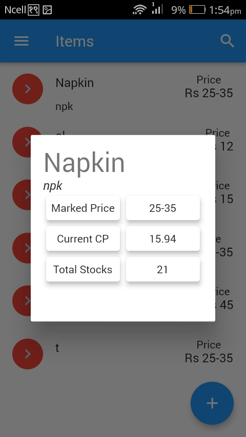
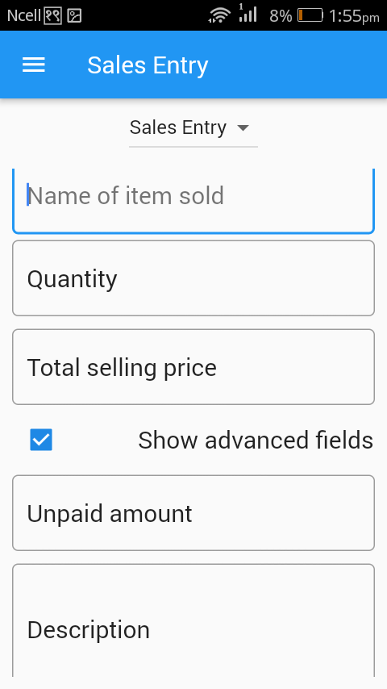

# inventory-management
## Features/Concepts Highlights
* Advanced state management solutions such as Provider are essential for optimizing Flutter applications. Here’s how various features and techniques can be implemented to enhance your app:

* Singleton Objects for Caching: Utilize singleton objects to cache data and ensure consistent access to instances throughout the application.

* UI Components: Implement navigation drawers, tabs, and search bars to improve user navigation. Enhance search functionalities with autocompletion and fuzzy search algorithms.

* Live UI Updates: Leverage Streams to provide real-time UI updates, ensuring a responsive user experience. Use Datatables to present data more effectively and routes to manage screen transitions seamlessly.

* Database Operations: Perform database operations in batches to ensure failproof transactions. Implement role-based modifications to maintain data integrity and security.

* Testing: Conduct thorough testing of your Flutter application to ensure robustness and reliability.

* Data Handling: Enable data export and import functionalities using CSV dumps to facilitate data management.

* Data Storage: Use Firebase's Cloud Firestore for online and offline NoSQL data storage, providing a flexible and scalable database solution.

* Authentication: Integrate authentication methods such as Google Sign-In and email authentication using Firebase Auth to secure user access.

* Continuous Integration: Implement continuous integration (CI) pipelines to streamline the development workflow, ensuring consistent code quality and automated testing.

## App overview
  
  
  
  


## Project Installation:

#### 1. Get Flutter
* Install flutter : [Flutter Installation](https://flutter.dev/docs/get-started/install)

#### 2. Clone this repo

#### 3. Setup the firebase app

1. You'll need to create a Firebase instance. Follow the instructions at https://console.firebase.google.com.
2. Once your Firebase instance is created, you'll need to enable Google authentication.

* Go to the Firebase Console for your new instance.
* Click "Authentication" in the left-hand menu
* Click the "sign-in method" tab
* Click "Google" and enable it

3. Enable the Firebase Database
* Go to the Firebase Console
* Click "Database" in the left-hand menu
* Click the Cloudstore "Create Database" button
* Select "Start in test mode" and "Enable"

4. (skip if not running on Android)
* Create an app within your Firebase instance for Android, with package name com.yourcompany.news
* Run the following command to get your SHA-1 key:

```
keytool -exportcert -list -v \
-alias androiddebugkey -keystore ~/.android/debug.keystore
```

* In the Firebase console, in the settings of your Android app, add your SHA-1 key by clicking "Add Fingerprint".
* Follow instructions to download google-services.json
* place `google-services.json` into `/android/app/`.

#### 4. Run
Connect your device 

```
$ flutter upgrade
$ flutter pub get
$ flutter run
```
